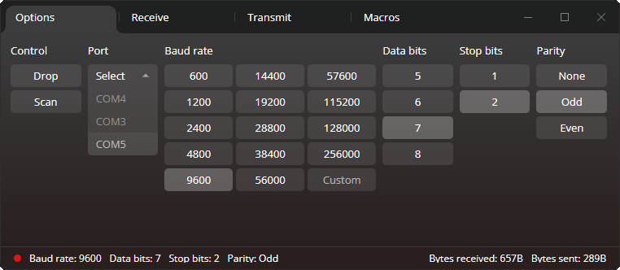
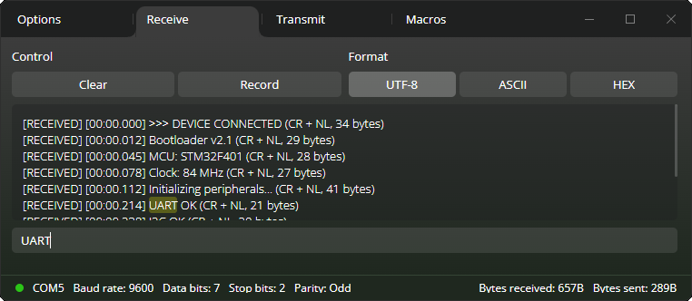
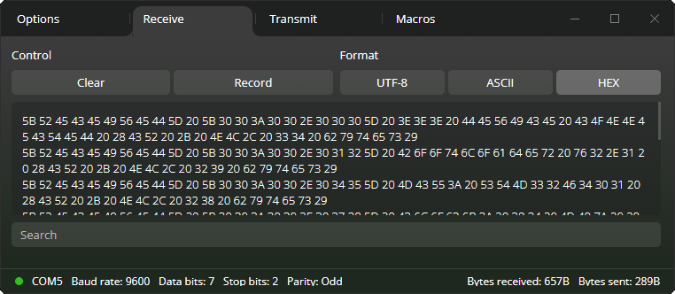
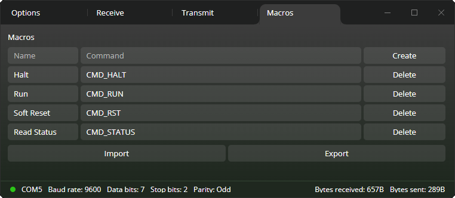
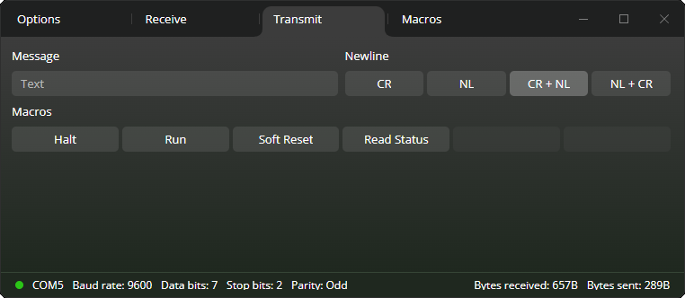

# Byteflow


Byteflow is a lightweight, cross-platform serial communication tool built with Tauri, designed to provide a polished and user-friendly interface for working with serial devices.

## Table of Contents

* [Features](#features)
* [Usage](#usage)
* [Getting Started](#getting-started)
* [License](#license)

---

## Features

* **Cross-platform** serial communication (Windows, Linux)
* **Receive** and display data in ASCII / UTF-8 / HEX
* **Send** messages with text or HEX mode
* **Macro support** (import/export JSON)
* **Save** received logs to a file

---

## Usage
Byteflow is designed to make serial communication simple while still giving you full control over connection and data formats.

### Connect to a Serial Device
<p align="center">
    
    <br/>
    <em>Scan for available serial devices and configure connection settings</em>
</p>

* Scan for available COM / serial devices
* Select a device and connect with a single click
* Choose a baud rate from common presets or enter a custom value
* Configure data bits, stop bits, and parity
* All connection settings are available in the **Options** tab

### Receive Serial Data
<p align="center">
    
    <br/>
    <em>Receive and inspect incoming serial messages in real time</em>
</p>
<p align="center">
    
    <br/>
    <em>Viewing incoming data formatted as hexadecimal</em>
</p>

* View incoming messages in real time
* Supported display formats:
  * UTF-8
  * ASCII
  * HEX
* Search the console for specific text
* Clear the console at any time
* Record all received data to a file for later analysis
* All receive-related features are available in the **Receive** tab

> *The second screenshot shows the same data displayed in HEX format*

### Macros
<p align="center">
    
    <br/>
    <em>Create reusable message macros</em>
</p>

* Create and delete custom macros
* Export macros to a JSON file
* Import macros from a JSON file
* Macros are automatically available in the **Transmit** tab for quick access

### Transmit Messages
<p align="center">
    
    <br/>
    <em>Send messages and trigger macros from the Transmit tab</em>
</p>

* Type messages directly into the input box
* Choose a newline character from four available options
* Send text or hex in the same input
  * Prefix your message with <code>\$</code> to send hex data <br/>
  Example: <code>\$01</code> sends a single byte <code>0x01</code>
  * Use <code>\$\$</code> to escape <code>\$</code> character <br/>
  Example: <code>\$\$01</code> sends the text <code>\$01</code>
* Trigger saved macros with a single click
* All sending functionality is available in the **Transmit** tab

---

## Getting Started

### Prerequisites

* Node.js (stable)
* Rust (stable)

> **Note:** Byteflow was developed and tested on **Windows**. Linux / macOS support may work, but it has not been tested.

### Clone the repository
```bash
git clone https://github.com/princepsnoctis/byteflow.git
cd byteflow
npm install
```

### Development (Tauri)
```bash
npm run tauri:dev
```

### Web UI only (no Tauri)
```bash
npm run dev
```

### Build (production):
```bash
npm run tauri:build
```

The production build is generated in: `src-tauri/target/release/bundle/`

---

## License

Byteflow is released under the MIT License. See the [LICENSE](LICENSE) file for details.